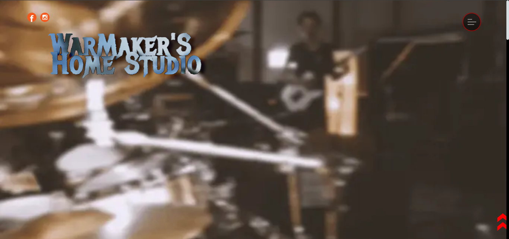

This is an Home Studio Page project for my personal Studio!

I made this website with basic HTML, CSS, and JavaScript with API for receive e-mail.

I used an API who its called "staticform". This get the form, transform in an e-mail model and send to my personal e-mail. I used this API for curiosity and i liked the simplicy of this hahahaha!

I used an simple youtube embed video, but i suffered to made it responsive in some resolutions... but its functionaly finnaly!

Some custom fonts in band names and other's place to make the page more "niiiiceeee...". Cool style i think uh? Hahahah Some hoover styles and custom menu and Etc.

in short: Its a nice landpage with some javascript and some good responsivity on mobiles views and etc!

Link for demo: https://warmakershstudio.vercel.app/

------------------------------------------------------------------------------------------------------

Esse é um projeto de Home Studio Page para meu estúdio pessoal!

Fiz este site com HTML básico, CSS e JavaScript com API para recebimento de e-mail.

Usei uma API chamada "staticform". Isso pega o formulário, transforma em modelo de e-mail e envia para meu e-mail pessoal. Usei essa API por curiosidade e gostei da simplicidade disso hahahaha!

Usei um simples vídeo incorporado do youtube, mas sofri para deixá-lo responsivo em algumas resoluções... mas finalmente está funcional!

Algumas fontes personalizadas nos nomes das bandas e outras no lugar para deixar a página mais "legaaaaall...". Estilo legal, eu acho, uh? Hahahah Alguns estilos de aspirador e menu personalizado e etc.

resumindo: é uma página de destino legal com algum javascript e uma boa responsividade nas visualizações de celulares e etc!

Link para demonstração: https://warmakershstudio.vercel.app/
